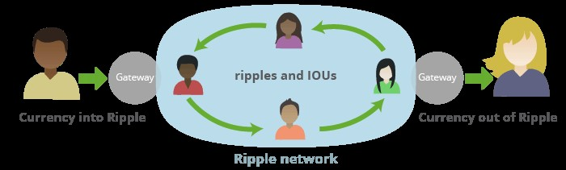
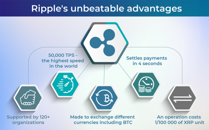

# FinTech-Case-Study

## Ripple Overview and Origin 

*  Ripple is a privately own enterprise blockchain company, it original started in 2011. In 2012 Opencoin was created and in 2013 Opencoin became Ripple Labs. The company  currently has more than 300 financial instutions on the RippleNet platform and operating in over 55+ countries.
 
* It was incorported in 2012 and founded by Chris Larsen and Jed McCaleb. [Ripple's Website](https://ripple.com/)

* Ripple idea started from three developers who wanted to create a distribution ledger that solves the restriction of Bitcoin.

* The company is funded by 36 inventors and has raised a total of $293.8m over 13 round in funding. Funding [Ripple funding information](https://www.crunchbase.com/organization/ripple-labs/company_financials)

## Ripple Business Activities 

* Ripple business activities is payment processing and cyprocurrency, which enable banks and financial institution to transfer cross-border payment through the use of _XRP_ on _Ripple network.

  > **RippleNet** is a digital payment processing system that allows money to move at the speed of the internet. [RippleNet Overview](https://ripple.com/ripplenet)

  > **XRP** is ripple cyptocurreny, a digital asset that is use on the XRP ledger for alternative liquid solution. XRP uses consensus protocol, which all validators has to agree on before the transaction is valid. [XRP Overview](https://xrpl.org/overview.html)

 

* Ripple solves the problem of different, slow, and costly processing fee in transfer of money. This is done by the of spreed and transparency around international payment by reducing the amount of days it takes to complete money transfer.

* The company intender users are Financial institution, banks and payment provider accross the world, such as Bank of America, JP Morgan Chase and Chartered Bank. 

* The unfair advantage Ripple uses are following: 
  > The ability to use alternative liquid solution with ripple global network through the use of IOU and XRP  digital asset to process payment accoss the world.

  > Ripple has the faster speed of money transfer in the world which is at 4 seconds compared to other payment system or cyptocurency.
  
  > Ripple is setup to exchange any currency meaning that no matter what currency is needed, there is always someone on the network that has it.

  > Ablity to transfer money without the middle man.

  > Ripple works with customers existing financial system.

[Ripple's Advantages](https://changelly.com/blog/invest-in-ripples-xrp-how-where-and-when/)

* The market size of the set of ripple's customers ranges from mid banks to top major banks and financial institution, like Bank of America with 2020 4th quarter at $21.307 billion in revenue.
[Ripple's customer](https://www.publish0x.com/xrp-community/full-list-of-ripple-customers-20192020-update-xmjwkg)

* Ripple uses a blockchain technology along with "6 other tools that are intergrated with it and they are python, Go, C++, Rust, Blockchain and wagyu". [Technology Informaton](https://stackshare.io/ripple)

## Ripple Landscape 

* Ripple is in the blockchain and crytocurreny domain of the financial industries.

* The major trends and innovation of this domain over the last 5 to 10 years are the following:

  > The domain managed to rollout blockchain-based to facilitate the movement of money across the borders partnering with financial institution.
 
  > Base on research, Blockchain innovation will allow the financial instution and investment banks to save up to $10 billion using blockchain technology.

* Major companys in the same domain as Ripple are Bitcoin, Ethereum,coinbase and Dogecoin [Ripple's Competitors](https://www.owler.com/company/ripple)

## Ripple Results 

* Ripple has impacted the business by unlocking economic barriers. This is done by the use of digital assest and distributed ledger technology, to reach bank and unbanked population world wide.

* The core metrics are measured in this domain by the number of processed transaction, the speed which they processed and finalized. Peer to peer subsytem matric, which we can refer to as volume and traffic. [performace matrix](https://hackernoon.com/how-to-measure-blockchain-network-performance-key-metrics-en1234u4)

* Base on the performance metrix Ripples has the fastest payment processing time in the world at about 3 - 4 seconds per transaction, therefore we can say they are perform better than their competitors in this area.

## Recomendations

* My recommendation will be to expand and facilitate the payment processing system to the general public not just the banks and financial institution. 

* By doing this they can actually maximize their revenue because a lot of the individual population uses Western union or MoneyGram.

* They will have to use another form of identity validation system to guide against fraud.

* The identity validation system is what is current been use by other payment processing company in business. This is necessary because of the need to identify the receiver.

Company Website [Ripple Website](https://ripple.com/)

Funding [Ripple funding information](https://www.crunchbase.com/organization/ripple-labs/company_financials)

what to know about Ripple  [more info about ripple](https://www.coindesk.com/10-things-you-need-to-know-about-ripple)

https://www.bitcoinmarketjournal.com/analysis/xrp/ripple/
 
Rippple's Advantages [Ripple's Advantages](https://changelly.com/blog/invest-in-ripples-xrp-how-where-and-when/)

XRP Ledger overview [XRP ledger](https://xrpl.org/overview.html)

Trends and innovation [Innovation](https://changelly.com/blog/ripple-xrp-price-prediction/)

Blockchain domain performance matric [performace matrix](https://hackernoon.com/how-to-measure-blockchain-network-performance-key-metrics-en1234u4)

Trends and innovation 
[Blockchain Innovation](https://www.wowso.me/blog/technology-in-banking#2)

[Blockchain Innovation](https://changelly.com/blog/ripple-xrp-price-prediction/)
