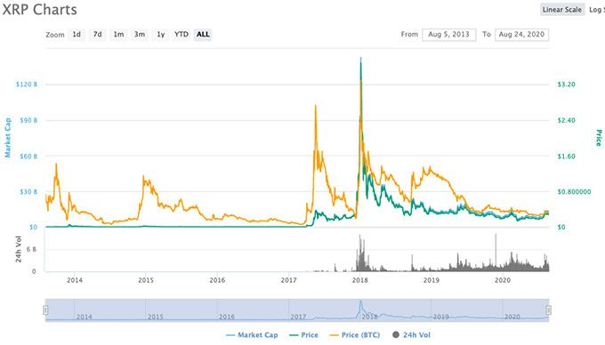

# FinTech-Case-Study

## Overview and Origin 

 Ripple is an enterprise blockchain company, they are a  digital payment processing system and cyprocurrency. It was incorported in 2012 and founded by Arthur Britto, chris Larsen and ryan Fugger. Ripple idea came into arise from. The company is funded by 36 inventors and has raised a total of $293.8m over 13 round in funding. Funding [Ripple funding information](https://www.crunchbase.com/organization/ripple-labs/company_financials)
Ripple is in over 55 countries where their partner operates. [Ripple's Website](https://ripple.com/)

 ## Business Activities 
  Ripple is a decentralized peer to peer network. that business activities involes **RippleNet** and **XRP**

 - _RippleNet_ is a digital payment processing system that allows money to move at the speed of the internet. This is done by the use of the .RippleNet is [RippleNet](https://ripple.com/ripplenet/)

 - _XRP_ is ripple cyptocurreny, it is a digital asset that is use for the transfer of on the rippleNet
 XRP is not like 
 
 

  Ripple solves the problem of Disparate, slow, error prone and costtly transfer of money. This is done by the of spreed and transparency around international payment by reducing the amount of days it takes to complete money transfer.The company intender user are Financial institution, banks  and payment provider accross the world.  

* The solution ripple offer that their competitior does not offer is the 

* The market size of the set if customer ripple has.
[Customer market size](https://www.publish0x.com/xrp-community/full-list-of-ripple-customers-20192020-update-xmjwkg)

* The unfair advantage they use are the ability to use alternative liquid solution with ripple global network through the use of XRP Ledger and it digital asset to process payment accoss the world faster.

    * ripple work with customer existing financial system

    * Ripple has the faster speed of money transfer in the world which is at 4 seconds compared to other payment system or cyptocurency.

    * Ripple is setup to exchange any currency mean that no matter what curreny you transfer that is always someone on the next work

[Ripple's Advantages](https://changelly.com/blog/invest-in-ripples-xrp-how-where-and-when/)

* Ripple use a blockchain technology
* Ripple uses block chain 

## Landscape 

* Ripple is in the blockchain and crytocurreny domain of the financial industries  

* What have been the major trends and innovations of this domain over the last 5-10 years?  

* The major trends and innovation of this domain over the last five years are 

* Other company in this domain are Bitcoin, Ethereum, coinbase and Dogecoin https://www.owler.com/company/ripple

* Ripple has impacted the business by unlocking economic barriers and by being able to c

Website [Company website](https://ripple.com/)

Funding [Ripple funding information](https://www.crunchbase.com/organization/ripple-labs/company_financials)

ripple [more info about ripple](https://www.coindesk.com/10-things-you-need-to-know-about-ripple)

https://www.bitcoinmarketjournal.com/analysis/xrp/ripple/

 

